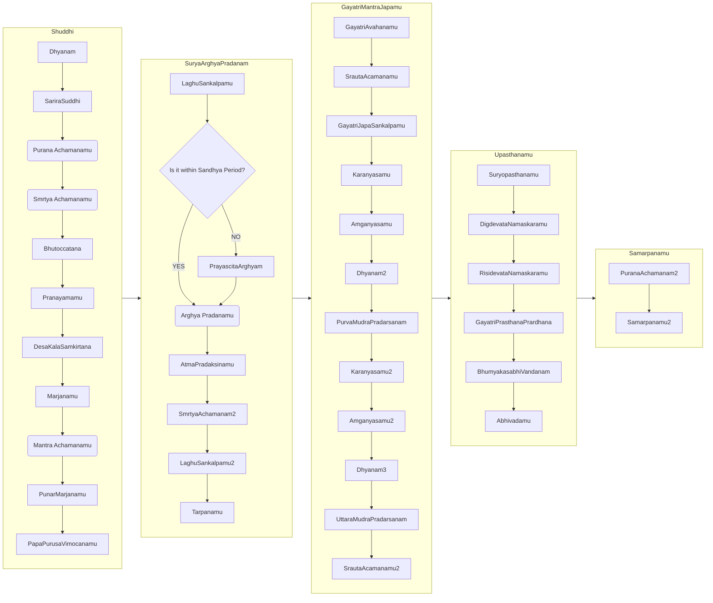

```mermaid

flowchart LR
    %% Shuddhi
    subgraph Shuddhi
        direction TB

        Dhyanam
        SariraSuddhi
        PuranaAchamanam(Purana Achamanamu)
        SmrtyaAchamanam(Smrtya Achamanamu)
        Bhutoccatana
        Pranayamamu
        DesaKalaSamkirtana
        Marjanamu
        MamtraAchamanam(Mantra Achamanamu)
        PunarMarjanamu
        PapaPurusaVimocanamu

        Dhyanam 
            --> SariraSuddhi 
            --> PuranaAchamanam 
            --> SmrtyaAchamanam
            --> Bhutoccatana
            --> Pranayamamu
            --> DesaKalaSamkirtana
            --> Marjanamu
            --> MamtraAchamanam
            --> PunarMarjanamu
            --> PapaPurusaVimocanamu
    end

    subgraph SuryaArghyaPradanam
        direction TB

        LaghuSankalpamu
        InCorrectWindow{Is it within Sandhya Period?}
        PrayascitaArghyam
        ArghyaPradanam(Arghya Pradanamu)
        AtmaPradaksinamu
        SmrtyaAchamanam2
        LaghuSankalpamu2
        Tarpanamu

        InCorrectWindow --> |YES| ArghyaPradanam
        InCorrectWindow --> |NO| PrayascitaArghyam

        LaghuSankalpamu 
            --> InCorrectWindow
        PrayascitaArghyam 
            --> ArghyaPradanam
            --> AtmaPradaksinamu
            --> SmrtyaAchamanam2
            --> LaghuSankalpamu2
            --> Tarpanamu
    end

    %% Mantra Japam
    subgraph GayatriMantraJapamu
        direction TB

        GayatriAvahanamu
        SrautaAcamanamu
        GayatriJapaSankalpamu
        Karanyasamu
        Amganyasamu
        Dhyanam2
        PurvaMudraPradarsanam
        Karanyasamu2
        Amganyasamu2
        Dhyanam3
        UttaraMudraPradarsanam
        SrautaAcamanamu2

        GayatriAvahanamu 
            --> SrautaAcamanamu
            --> GayatriJapaSankalpamu
            --> Karanyasamu
            --> Amganyasamu
            --> Dhyanam2
            --> PurvaMudraPradarsanam
            --> Karanyasamu2
            --> Amganyasamu2
            --> Dhyanam3
            --> UttaraMudraPradarsanam
            --> SrautaAcamanamu2
    end

    subgraph Upasthanamu
        direction TB

        Suryopasthanamu
        DigdevataNamaskaramu
        RisidevataNamaskaramu
        GayatriPrasthanaPrardhana
        BhumyakasabhiVandanam
        Abhivadamu

        Suryopasthanamu
            --> DigdevataNamaskaramu
            --> RisidevataNamaskaramu
            --> GayatriPrasthanaPrardhana
            --> BhumyakasabhiVandanam
            --> Abhivadamu
    end

    subgraph Samarpanamu
        direction TB

        PuranaAchamanam2
        Samarpanamu2

        PuranaAchamanam2
            --> Samarpanamu2
    end

    %% 
    Shuddhi 
        --> SuryaArghyaPradanam 
        --> GayatriMantraJapamu 
        --> Upasthanamu
        --> Samarpanamu

```
