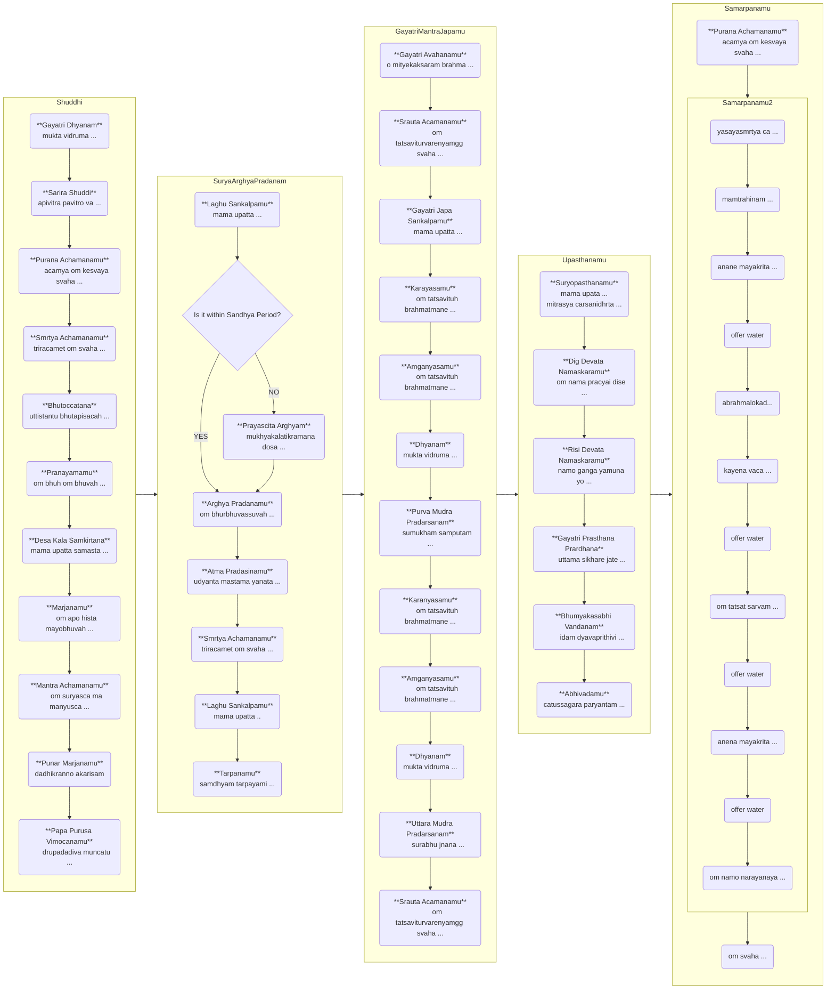

```mermaid

flowchart LR
    %% Shuddhi
    subgraph Shuddhi
        direction TB

        Dhyanam(**Gayatri Dhyanam**
        mukta vidruma ...)
        SariraSuddhi(**Sarira Shuddi**
        apivitra pavitro va ...)
        PuranaAchamanam(**Purana Achamanamu**
        acamya om kesvaya svaha ...)
        SmrtyaAchamanam(**Smrtya Achamanamu**
        triracamet om svaha ...)
        Bhutoccatana(**Bhutoccatana**
        uttistantu bhutapisacah ...)
        Pranayamamu(**Pranayamamu**
        om bhuh om bhuvah ...)
        DesaKalaSamkirtana(**Desa Kala Samkirtana**
        mama upatta samasta ...)
        Marjanamu(**Marjanamu**
        om apo hista mayobhuvah ...)
        MamtraAchamanam(**Mantra Achamanamu**
        om suryasca ma manyusca ...)
        PunarMarjanamu(**Punar Marjanamu**
        dadhikranno akarisam)
        PapaPurusaVimocanamu(**Papa Purusa Vimocanamu**
        drupadadiva muncatu ...)

        Dhyanam 
            --> SariraSuddhi 
            --> PuranaAchamanam 
            --> SmrtyaAchamanam
            --> Bhutoccatana
            --> Pranayamamu
            --> DesaKalaSamkirtana
            --> Marjanamu
            --> MamtraAchamanam
            --> PunarMarjanamu
            --> PapaPurusaVimocanamu
    end

    subgraph SuryaArghyaPradanam
        direction TB

        LaghuSankalpamu(**Laghu Sankalpamu**
        mama upatta ...)
        InCorrectWindow{Is it within Sandhya Period?}
        PrayascitaArghyam(**Prayascita Arghyam**
        mukhyakalatikramana dosa ...)
        ArghyaPradanam(**Arghya Pradanamu**
        om bhurbhuvassuvah ...)
        AtmaPradaksinamu(**Atma Pradasinamu**
        udyanta mastama yanata ...)
        SmrtyaAchamanam2(**Smrtya Achamanamu**
        triracamet om svaha ...)
        LaghuSankalpamu2(**Laghu Sankalpamu**
        mama upatta ..)
        Tarpanamu(**Tarpanamu**
        samdhyam tarpayami ...)

        InCorrectWindow --> |YES| ArghyaPradanam
        InCorrectWindow --> |NO| PrayascitaArghyam

        LaghuSankalpamu 
            --> InCorrectWindow
        PrayascitaArghyam 
            --> ArghyaPradanam
            --> AtmaPradaksinamu
            --> SmrtyaAchamanam2
            --> LaghuSankalpamu2
            --> Tarpanamu
    end

    %% Mantra Japam
    subgraph GayatriMantraJapamu
        direction TB

        GayatriAvahanamu(**Gayatri Avahanamu**
        o mityekaksaram brahma ...)
        SrautaAcamanamu(**Srauta Acamanamu**
        om tatsaviturvarenyamgg svaha ...)
        GayatriJapaSankalpamu(**Gayatri Japa Sankalpamu**
        mama upatta ...)
        Karanyasamu(**Karayasamu**
        om tatsavituh brahmatmane ...)
        Amganyasamu(**Amganyasamu**
        om tatsavituh brahmatmane ...)
        Dhyanam2(**Dhyanam**
        mukta vidruma ...)
        PurvaMudraPradarsanam(**Purva Mudra Pradarsanam**
        sumukham samputam ...)
        Karanyasamu2(**Karanyasamu**
        om tatsavituh brahmatmane ...)
        Amganyasamu2(**Amganyasamu**
        om tatsavituh brahmatmane ...)
        Dhyanam3(**Dhyanam**
        mukta vidruma ...)
        UttaraMudraPradarsanam(**Uttara Mudra Pradarsanam**
        surabhu jnana ...)
        SrautaAcamanamu2(**Srauta Acamanamu**
        om tatsaviturvarenyamgg svaha ...)

        GayatriAvahanamu 
            --> SrautaAcamanamu
            --> GayatriJapaSankalpamu
            --> Karanyasamu
            --> Amganyasamu
            --> Dhyanam2
            --> PurvaMudraPradarsanam
            --> Karanyasamu2
            --> Amganyasamu2
            --> Dhyanam3
            --> UttaraMudraPradarsanam
            --> SrautaAcamanamu2
    end

    subgraph Upasthanamu
        direction TB

        Suryopasthanamu(**Suryopasthanamu**
        mama upata ...
        mitrasya carsanidhrta ...)
        DigdevataNamaskaramu(**Dig Devata Namaskaramu**
        om nama pracyai dise ...)
        RisidevataNamaskaramu(**Risi Devata Namaskaramu**
        namo ganga yamuna yo ...)
        GayatriPrasthanaPrardhana(**Gayatri Prasthana Prardhana**
        uttama sikhare jate ...)
        BhumyakasabhiVandanam(**Bhumyakasabhi Vandanam**
        idam dyavaprithivi ...)
        Abhivadamu(**Abhivadamu**
        catussagara paryantam ...)

        Suryopasthanamu
            --> DigdevataNamaskaramu
            --> RisidevataNamaskaramu
            --> GayatriPrasthanaPrardhana
            --> BhumyakasabhiVandanam
            --> Abhivadamu
    end

    subgraph Samarpanamu
        direction TB

        PuranaAchamanam2(**Purana Achamanamu**
        acamya om kesvaya svaha ...)

        subgraph Samarpanamu2
            direction TB

            A(yasayasmrtya ca ...)
            B(mamtrahinam ...)
            C(anane mayakrita ...)
            D(abrahmalokad...)
            E(kayena vaca ...)
            F(om tatsat sarvam ...)
            G(anena mayakrita ...)
            H(om namo narayanaya ...)
            A 
                --> B
                --> C
                --> O1(offer water)
                --> D
                --> E
                --> O2(offer water)
                --> F
                --> O3(offer water)
                --> G
                --> O4(offer water)
                --> H
        end

        PuranaAchamanam2
            --> Samarpanamu2
            --> Svaha(om svaha ...)
    end

    %% 
    Shuddhi 
        --> SuryaArghyaPradanam 
        --> GayatriMantraJapamu 
        --> Upasthanamu
        --> Samarpanamu

```
